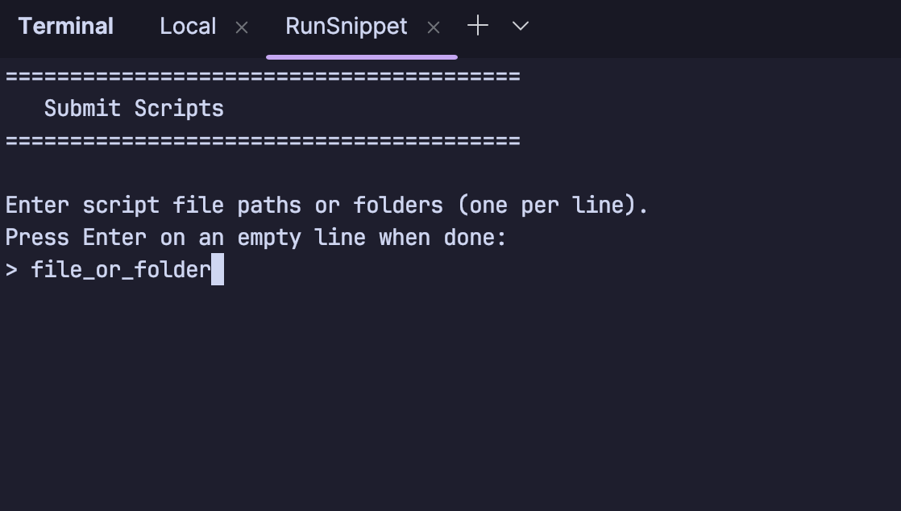
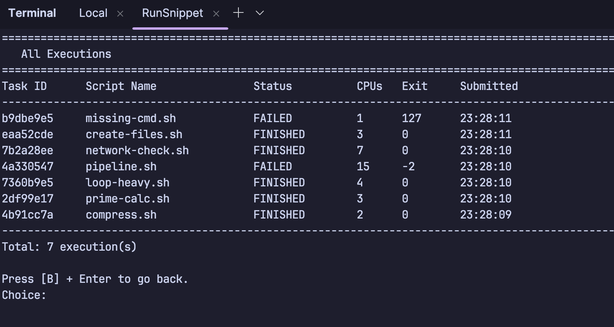
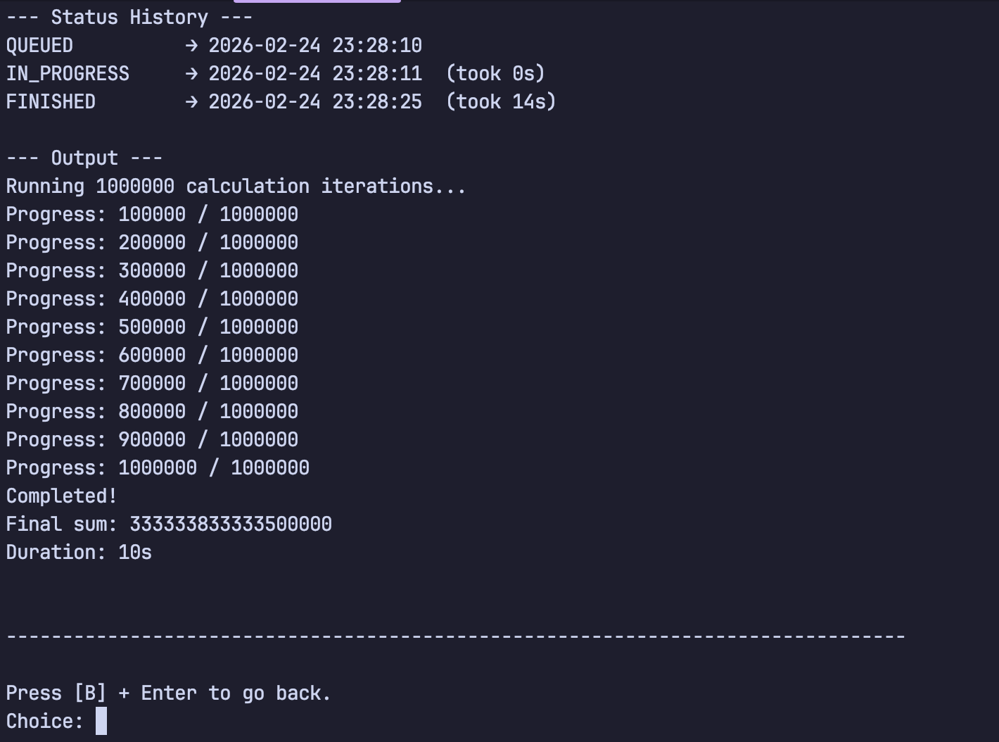

# Remote Executor

A distributed system for executing shell scripts on remote machines with CPU resource management. The controller sends commands and the executor runs them in isolated Docker containers.

## Table of Contents

- [Overview](#overview)
- [Architecture](#architecture)
  - [Communication Flow](#communication-flow)
  - [Execution Statuses](#execution-statuses)
- [Project Structure](#project-structure)
- [Getting Started](#getting-started)
  - [Prerequisites](#prerequisites)
  - [Infrastructure Setup](#infrastructure-setup)
  - [Configuration](#configuration)
  - [Running the Application](#running-the-application)
- [Technology Stack](#technology-stack)
- [Screenshots](#screenshots)

## Overview

Remote Executor enables one machine (Controller) to send shell scripts to another machine (Executor) for execution. The Executor runs scripts inside Docker containers with configurable CPU limits, providing isolation and resource management.

## Architecture

### Communication Flow

The system uses two AWS SQS queues for communication:

```
┌────────────┐     command-queue      ┌────────────┐
│            │ ───────────────────▶   │            │
│ Controller │                        │  Executor  │
│            │  ◀───────────────────  │            │
└────────────┘      status-queue      └────────────┘
```

| Queue | Direction | Purpose |
|-------|-----------|---------|
| `command-queue` | Controller → Executor | Sends task requests with script content and CPU requirements |
| `status-queue` | Executor → Controller | Returns execution status updates and output |

**Message Flow:**

1. User submits a script via Controller CLI with CPU requirements
2. Controller saves execution record (status: `QUEUED`) and publishes to `command-queue`
3. Executor polls `command-queue`, checks available CPU resources
4. If resources available: accepts task, sends `IN_PROGRESS` status
5. Executor creates Docker container with CPU limits, executes script
6. Executor sends `FINISHED` or `FAILED` status with output to `status-queue`
7. Controller polls `status-queue` and updates database
8. User queries execution status via Controller CLI

### Execution Statuses

| Status | Description |
|--------|-------------|
| `QUEUED` | Command received, waiting for executor |
| `IN_PROGRESS` | Executor accepted command, executing |
| `FINISHED` | Command completed successfully (exit code 0) |
| `FAILED` | Command failed (non-zero exit code or error) |

## Project Structure

```
remote-executor/
├── controller/          # Controller module (CLI + status polling)
│   └── src/main/java/com/pekara/controller/
│       ├── cli/         # Interactive CLI interface
│       ├── application/ # Application services
│       ├── domain/      # Domain models and repositories
│       ├── infrastructure/
│       │   ├── messaging/    # SQS publishers/consumers
│       │   └── persistence/  # SQLite repository
│       └── worker/      # Status poller background worker
├── executor/            # Executor module (task execution)
│   └── src/main/java/com/pekara/executor/
│       ├── application/ # Task execution services
│       ├── domain/      # Domain models
│       ├── infrastructure/
│       │   ├── container/  # Docker container runner
│       │   ├── messaging/  # SQS publishers/consumers
│       │   └── resource/   # CPU resource manager
│       └── worker/      # Task poller and execution workers
├── common/              # Shared utilities (JSON, SQS client)
├── infra/terraform/     # Infrastructure as code for SQS queues
└── scripts/             # Example shell scripts for testing
```

## Getting Started

### Prerequisites

- Java 21
- Maven
- Docker
- Terraform
- LocalStack (for local development) or AWS account

### Infrastructure Setup

1. **Copy the example variables file:**

   ```bash
   cd infra/terraform
   cp terraform.tfvars.example terraform.tfvars
   ```

2. **Edit `terraform.tfvars`** (optional for local development):

   ```hcl
   # For LocalStack (default)
   use_localstack = true
   aws_endpoint   = "http://localhost:4566"

   # For real AWS
   use_localstack = false
   aws_region     = "us-east-1"
   aws_access_key = "your-access-key"
   aws_secret_key = "your-secret-key"
   ```

3. **Start LocalStack** (for local development):

   ```bash
   docker run -d -p 4566:4566 localstack/localstack
   ```

4. **Provision SQS queues:**

   ```bash
   cd infra/terraform
   terraform init
   terraform apply
   ```

### Configuration

1. **Copy the environment example file:**

   ```bash
   cp .env.example .env
   ```

2. **Edit `.env`** as needed:

   ```bash
   # AWS/LocalStack Configuration
   AWS_REGION=us-east-1
   AWS_ACCESS_KEY_ID=test
   AWS_SECRET_ACCESS_KEY=test
   AWS_ENDPOINT=http://localhost:4566

   # SQS Queue URLs
   COMMAND_QUEUE_URL=http://localhost:4566/000000000000/command-queue
   STATUS_QUEUE_URL=http://localhost:4566/000000000000/status-queue

   # Controller Database
   DB_PATH=./db/controller.db

   # Executor Settings
   POLL_INTERVAL_MS=1000
   SQS_WAIT_TIME_S=20
   VISIBILITY_TIMEOUT_S=300
   HEARTBEAT_INTERVAL_S=240
   DOCKER_IMAGE=bash:latest
   ```

### Running the Application

1. **Build the project:**

   ```bash
   mvn clean install
   ```

2. **Run the Executor** (on the remote machine):

   ```bash
   cd executor
   mvn exec:java -Dexec.mainClass="com.pekara.executor.Main"
   ```

3. **Run the Controller** (on the local machine):

   ```bash
   cd controller
   mvn exec:java -Dexec.mainClass="com.pekara.controller.Main"
   ```

   The Controller provides an interactive CLI to:
   - Submit new scripts for execution
   - View execution status and history
   - Check execution output

## Technology Stack

| Component | Technology |
|-----------|------------|
| Language | Java 21 |
| Build | Maven (monorepo) |
| Messaging | AWS SQS (LocalStack for dev) |
| Database | SQLite |
| Container Runtime | Docker |
| Infrastructure | Terraform |
| Config | Owner library, dotenv-java |

## Screenshots

### Submit Script



### All Scripts Overview



### Script Details


